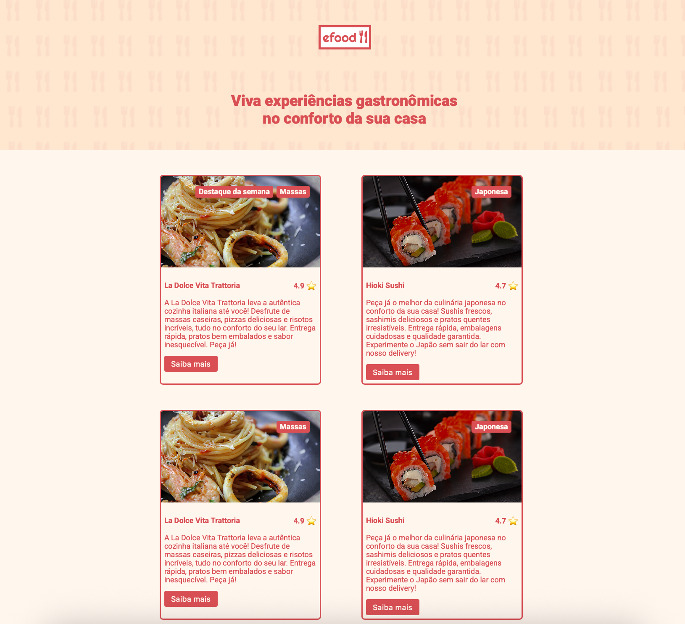
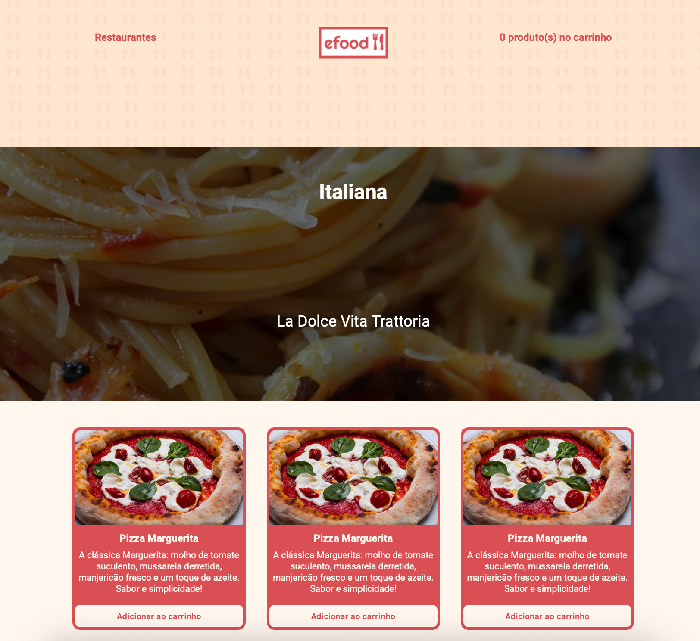
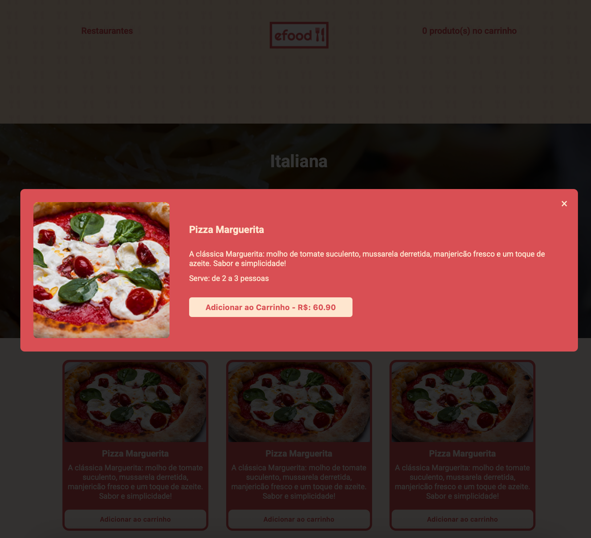
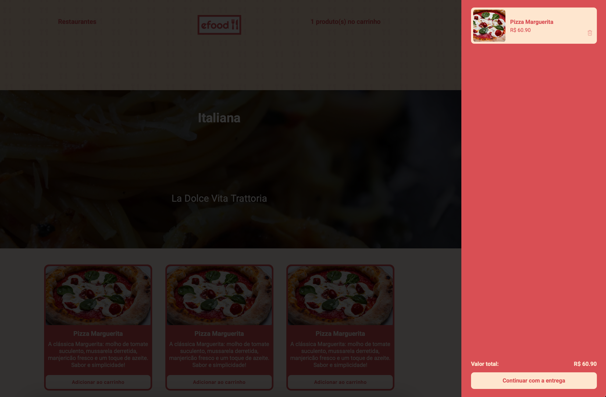

# 📦 eFood — Clone do iFood com React + Styled Components

Uma aplicação completa de delivery, inspirada no iFood, desenvolvida com foco em componentização, boas práticas de React e estilização moderna usando Styled Components.

## 📸 Preview

## 🎯 Descrição do Projeto

Este projeto é uma réplica simplificada do iFood, desenvolvida a partir de um layout disponível no Figma, com o objetivo de simular a experiência completa de um aplicativo de delivery. A aplicação permite ao usuário:

- Navegar por diferentes restaurantes
- Visualizar e adicionar pratos ao carrinho
- Inserir informações de entrega
- Realizar o pagamento
- Visualizar uma tela de confirmação do pedido

Tudo isso com uma navegação fluida e uma interface moderna construída com React e Styled Components.

---

## 🚀 Tecnologias Utilizadas

- **React** (Vite) — Biblioteca principal da aplicação
- **TypeScript** — Tipagem estática e segurança de código
- **Styled Components** — Estilização com CSS-in-JS
- **React Router** — Navegação entre páginas

---

## 📁 Funcionalidades

- ✅ Listagem de restaurantes com estilos individuais
- ✅ Modal com detalhes dos pratos
- ✅ Carrinho lateral com sistema de remoção e totalização
- ✅ Formulário de endereço com validação básica
- ✅ Tela de pagamento com simulação de finalização
- ✅ Tela de confirmação do pedido com número gerado
- ✅ Componentes reutilizáveis e organizados por responsabilidades

---

## 💡 Aprendizados e Destaques Técnicos

Durante o desenvolvimento, os principais pontos de aprendizado foram:

- Criação de componentes modulares e reutilizáveis
- Uso eficiente de `useState` e `useEffect` para controle de estado
- Gerenciamento de múltiplos drawers sobrepostos (carrinho, endereço, pagamento, confirmação)
- Boas práticas de organização de pastas e arquivos
- Navegação com React Router com controle de múltiplas telas no mesmo componente

---

## 📌 Desafios Técnicos Enfrentados

- Implementação da navegação condicional entre etapas do pedido
- Manipulação de múltiplos drawers sobrepostos de forma organizada
- Gerenciamento do carrinho e etapas do pedido
